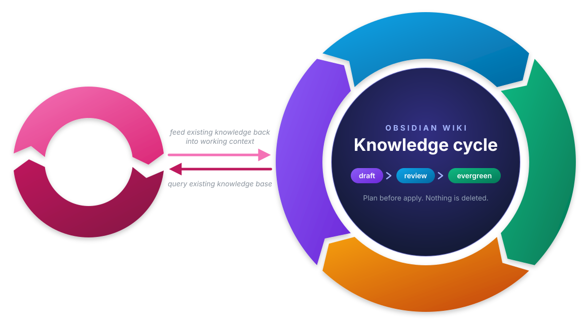

# obsidian-wiki

A Claude Code plugin marketplace that keeps a personal Obsidian vault tidy. It is inspired by [claude-obsidian](https://github.com/AgriciDaniel/claude-obsidian) (MIT), which builds on Karpathy's LLM Wiki pattern: drop knowledge in an inbox, let Claude file and link it, and query what you already know. All code here is written from scratch; only the ideas are reused (inbox first, plan before apply, read-only query).

I recreated it myself for three reasons:

- **No native Windows support.** claude-obsidian does not write to a vault from Windows.
- **The WSL workaround is too cumbersome** for the handful of tools I actually use:
  - it needs WSL with a Linux distro, just to install the Python engine in there;
  - I have to run Claude Code inside a WSL terminal whenever I work with the vault.
- **Easy to use and manage.** Small separate plugins, so I update only what I want, when I want it, without bloat I will never use.

## How this marketplace improves my Obsidian workflow

Each plugin gives Claude one clear job in the vault: save an answer, file a draft, check vault health, or answer from my notes. Claude always follows the vault's own `CLAUDE.md` rules, so I never have to explain folders, frontmatter or linking again, and no skill ever deletes a note.

Together the plugins form a knowledge cycle. Research and writing produce `draft` notes in the Inbox, ingest files them (`review`), apply approves them (`evergreen`), and lint keeps the vault healthy along the way. Query feeds existing knowledge back into new work, so I build on what I already know instead of rewriting it.



## Install and usage guide

### Install

At user scope, so the skills work in every project:

```
/plugin marketplace add https://github.com/PoTAsh2000/obsidian-wiki.git
/plugin install wiki-vault@obsidian-wiki
/wiki-vault:add C:/Users/you/Obsidian/MyVault
/plugin install wiki-query@obsidian-wiki
```

Install the other plugins the same way: `wiki-save`, `wiki-ingest` and `wiki-lint`.

Some plugins depend on others. `wiki-ingest` calls `wiki-lint` to check notes before and after filing them, so installing `wiki-ingest` installs `wiki-lint` automatically. The other plugins stand on their own.

You configure the vault folder once with `wiki-vault`. It stores the path in `~/.claude/obsidian-wiki/vault-path`, and every other skill reads it from there. When no path is configured, a skill stops and tells you to run `/wiki-vault:add`.

Auto-update is off by default for third-party marketplaces. Turn it on once: `/plugin`, Marketplaces tab, `obsidian-wiki`, "Enable auto-update". To update right away: `/plugin marketplace update obsidian-wiki`.

### Examples

| Command | What it does |
|---|---|
| `/wiki-vault:add C:/Users/you/Obsidian/MyVault` | Configure the vault folder for all plugins (asks for it when no path is given) |
| `/wiki-vault:overwrite D:/Notes/Vault` | Replace the configured vault folder |
| `/wiki-vault:delete` | Remove the configured vault folder |
| `/wiki-save:save` | Save the last useful answer as a `draft` in `01. Inbox` (Claude proposes a title) |
| `/wiki-save:save Dolphin sleep patterns` | Same, with a given title |
| `/wiki-ingest:ingest` | List all `draft` notes, ask which one, then plan moving it out of the Inbox |
| `/wiki-ingest:ingest all` | Plan every `draft` note |
| `/wiki-ingest:apply` | Mark every `review` note as `evergreen` (only runs when typed) |
| `/wiki-lint:lint` | Full vault check: moves stray drafts, unlinks dead links, reports the rest |
| `/wiki-lint:lint --files "01. Inbox/"` | Same, for every note in one folder |
| `/wiki-query:query how do seals stay warm?` | Answer from my notes with `[[Note]]` citations |
| `/wiki-query:name dolphin` | Notes whose filename or title contains "dolphin" |
| `/wiki-query:tag mammals reefs` | Notes per tag |
| `/wiki-query:topic seals` | Notes per topic |
| `/wiki-query:status review draft` | Notes per status |

Normal language works too: "save this to my vault", "process my inbox", "check my vault", "what do I already know about orca migration?".

## Contribution

This repo was originally created for my personal use. If you find a bug or want to see a feature, feel free to [open an issue](https://github.com/PoTAsh2000/obsidian-wiki/issues/new/choose) using the bug or feature template. A change will probably only be accepted if it still matches my own use case.

If you like the repo, feel free to give it a star 
